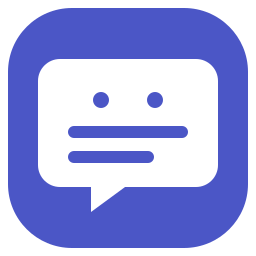

<p align="center"></p>
<h1 align="center">Jamak</h1>
<p align="center">Live subtitles, right in your browser.</p>

**Jamak** (자막, /dʒɑːmɑːk/) means “subtitles” in Korean. It is a Chrome extension that turns tab audio into live Korean captions using on-device speech recognition and translation.

[Privacy policy / 개인정보처리방침](PRIVACY.md)

## Features

- Optionally detects English, Japanese and Korean per speech turn. English/Japanese → Korean subtitles; Korean speech keeps its original text.
- Select English, Japanese or Korean manually to disable automatic detection. Manual Japanese is the default.
- Captures the selected tab's audio, including videos, iframes and Web Audio. Playback remains audible.
- Updates captions as speech arrives and corrects them as recognition completes.
- Distinguishes speakers with background colors, without speaker labels.
- Shows ready captions immediately below earlier captions in a bounded toast-style stack. Visible captions read concurrently and leave oldest first; each completed part remains for 4–6 seconds, then fades out.
- Keeps captions visible over fullscreen videos and players, including fullscreen videos inside embedded frames. Playback controls remain clickable.
- Opens a separate original/translation history window.
- Offers a separate **Advanced · 모델 선택** window with independent recognition/translation selectors. Selecting a model starts its download/preparation; saved choices and downloaded files are reused.
- Shows each selected model's download status in Advanced, including partial cached files and completed Chrome packs, plus current preparation progress. Advanced preparation sends a desktop Chrome notification once models are ready, even after the window closes.
- Runs speech recognition, translation and speaker analysis locally. No API key or companion app required.

## Install and use

Requires desktop Chrome **138+**. Chrome defaults require available on-device speech/translation packs; selected Whisper q8 and translation q8 models run on CPU/WASM, while Whisper FP16 requires WebGPU. API and model availability depend on your Chrome version, device and language.

```sh
git clone https://github.com/norux/jamak.git
cd jamak
npm ci
npm run build
```

1. Open `chrome://extensions`, enable **Developer mode**, and choose **Load unpacked**.
2. Select `apps/chrome/dist`.
3. Open a page with audio, click Jamak, and choose English, Japanese or Korean manually (Japanese by default), or enable the **자동 감지** checkbox for multilingual speech. Selecting a source language turns automatic detection off. Manual Korean uses Whisper and displays the original without translation.
4. Use Chrome defaults, or open **Advanced · 모델 선택** to choose recognition and translation separately. Selecting an option stops the current session and prepares the new models immediately; closing the window does not stop downloads. Each selector shows whether its model still needs downloading or is stored locally; completed downloads can still be loading. A Chrome desktop notification announces readiness. Allow Chrome notifications in your OS settings to receive it. **양쪽 모두 Chrome 기본값** restores both defaults. Then return to the original tab.
5. Prepare the models once; the popup shows a progress bar for the current download/preparation stage, including when reopened. **모델 정보** opens a compact table of the selected recognition, translation, voice-activity and speaker models. Then click **번역 시작**. Click **중지** to stop.

With Chrome defaults, automatic mode requires WebGPU and prepares Whisper Turbo plus both English/Japanese → Korean translation pairs. Advanced can select a different multilingual Whisper and one multilingual local translation model instead. The first preparation downloads language packs and model files; internet access is required for downloads. With Chrome recognition selected, manual English and Japanese prefer Chrome local streaming recognition, showing interim text and correcting it as recognition completes. Whisper is the fallback when the local speech API is unsupported; it requires WebGPU and about 1.6 GB for the speech model. Prepared models run locally. Restricted Chrome pages cannot show the overlay. Microphone and system-wide audio capture are not supported.

## Platforms

| Platform | Status |
| --- | --- |
| Chrome extension · desktop | Supported |
| Safari extension · iPhone | Planned |
| macOS desktop app | Planned |

## Development

Node.js **22.12+** is required.

```sh
npm run dev       # Watch and rebuild the extension; reload it in Chrome
npm run verify    # Lint, types, build, unit tests and caption display checks
npm run test:conversation # Serve English (~58 s) and Japanese (~76 s) conversations
```

The conversation player opens at `http://127.0.0.1:8790`; select Japanese with the page link or `?language=ja`. Both fixtures contain eight distinct turns and two synthetic voices. Real model and tab-capture checks are documented in [Testing](docs/testing.md).

See [Architecture](docs/architecture/media-framework.md), [Coding conventions](docs/coding-conventions.md), and [AGENTS.md](AGENTS.md) before contributing. Feature changes must keep code and these documents consistent.

## Publishing to Chrome Web Store

After [one-time developer account and OAuth setup](docs/releasing.md), run `npm run release:chrome` to verify, build, ZIP, upload and submit for review. Approval publishes automatically with the store item's existing distribution settings. Run `npm run release:chrome -- --dry-run` to verify and create the ZIP without store requests. Update the extension manifest version before each new upload; store metadata and privacy declarations are configured in the developer dashboard.

For Orca workspaces, keep credentials in the main checkout and configure `.env.chrome-store` as a [worktree shared path](docs/releasing.md#orca-workspaces) so newly created workspaces receive the private file.

## Models and limitations

Chrome SODA and TranslateKit provide local recognition and translation when available. With Chrome defaults, automatic mode and the fallback use Whisper large-v3-turbo with Silero VAD. Advanced offers Whisper Tiny/Base/Small q8 on CPU, Small FP16 and Large v3 Turbo FP16 on WebGPU, plus independent Chrome TranslateKit/NLLB-200 Distilled 600M q8/M2M100 418M q8 translation. Download sizes range from ~44 MB for Tiny to ~1.6 GB for Turbo; NLLB is ~912 MB and M2M100 ~640 MB. These alternatives can be slower or less accurate; changing models is for comparison, not a latency guarantee. Automatic mode reuses one acoustic encoder pass for language detection and transcription, keeps the translation pairs ready, and uses recent language only to break uncertain ties. Speaker history does not determine language. WeSpeaker provides session-local speaker embeddings. The Japanese Whisper fallback retains unfinished phrases across recognition windows. Chrome Japanese translation handles conversational endings and question marks. Interim captions may change as speech continues; recognition and translation can still misinterpret individual words or relationships. Short responses may have no speaker assignment; overlapping speech, noise and similar voices can reduce accuracy.

Automatic language switching currently follows speech pauses; simultaneous voices or language changes without a pause can share one recognition window. It is not instantaneous: inference and caption confirmation add delay, and short ambiguous speech can be misidentified.

Model weights have their own licenses. [NLLB](https://huggingface.co/facebook/nllb-200-distilled-600M) is CC-BY-NC-4.0 and intended for research/noncommercial use; [M2M100](https://huggingface.co/facebook/m2m100_418M) is MIT. See [model attribution and speaker verification](docs/verification/captions/conversation-speakers.md) and the [architecture model inventory](docs/architecture/media-framework.md#models).

## License

[MIT](LICENSE). Model weights and dependencies retain their own licenses.
