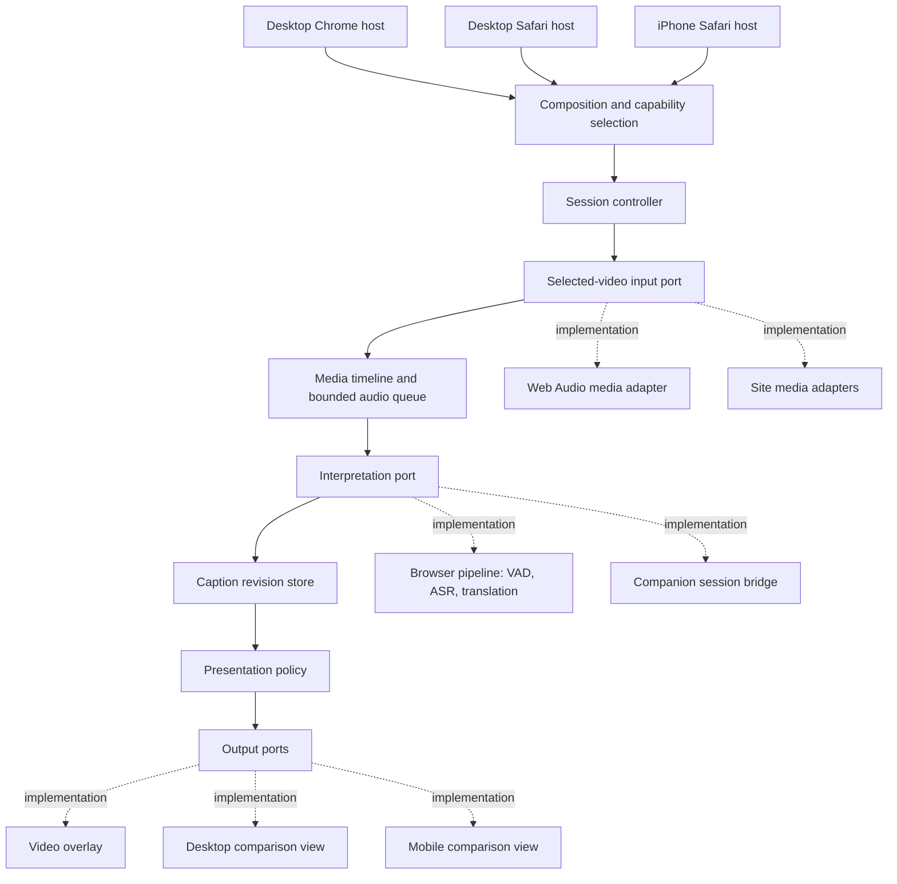
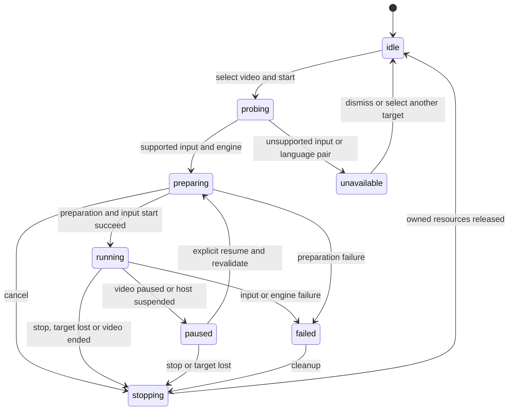

# Interpreter media framework

Status: proposed architecture, 2026-10-06. No browser-only engine or iPhone
support is implemented by this document. The published companion remains v0.1.0.

## Product boundary

The user starts interpretation for **one selected video on the current page**.
Other videos, other tabs and system audio are outside this session. When multiple
videos are visible, offer a suggested target and let the user confirm or select
another. Do not silently change targets when an advertisement or another video
starts. Navigation or replacement of the selected element invalidates its handle.

Design the framework for desktop Chrome, desktop Safari and iPhone Safari from
the outset. Share session behavior, data contracts and inference orchestration;
provide separate platform hosts, media access and presentation implementations.
The existing companion is an additional execution backend within this design.

A smaller Chrome-only refactor could deliver a browser prototype sooner. This
design intentionally establishes the broader framework requested by the user,
including execution contexts, lifecycle, compatibility and acceptance criteria.

The central feasibility condition is **access to samples from that video**.
Finding a `<video>` element or observing its playback does not establish sample
access. [Web Audio specifies silence for CORS-cross-origin media](https://www.w3.org/TR/webaudio/#MediaElementAudioSourceNode).
Site permissions do not remove that restriction. Mobile Safari support must be
established against real media and a physical iPhone before being advertised.

## Architecture and dependency direction



Ports are explicit TypeScript contracts, composed through factory functions.
Core modules import contracts and other core modules only. They must not import
`chrome`, `browser`, DOM nodes, WebGPU, MLX, Ollama, sockets or Swift APIs. Adapters
depend on contracts, never the reverse. Hosts assemble concrete adapters and own
platform permissions and process lifetime. No browser-name branches inside core.

The framework supports first-party adapters registered at build time. It does
not require downloadable executable plugins, a dependency injection container or
arbitrary runtime module discovery. Model files have a separate download/cache
lifecycle from executable extension code.

## Module boundaries

The following is the intended layout, not a claim that these packages exist yet.

```text
packages/
  contracts/          media, session, engine, caption and capability contracts
  core/               session lifecycle, timeline, queues, revisions, policy
  media-web/          selected-element discovery and Web Audio input
  engines-browser/    worker VAD/ASR and translation implementations
  engines-companion/  current authenticated HTTP/WebSocket protocol bridge
  presentation-web/  DOM overlay and comparison components
  testing/            adapter conformance fixtures and cross-host scenarios
apps/
  chrome/             manifest, service worker, document host, controls
  safari/             Safari web resources and platform host
  safari-native/      iOS/macOS container and optional native engine bridge
server/               existing companion implementations
companion/            existing macOS packaging and launcher
```

Separate packages become useful because there are multiple explicit deployment
targets. Extract code incrementally with behavioral checks; moving directories
alone is not a migration milestone. Platform-neutral contracts must compile with
an ES library and no DOM or browser extension ambient types.

## Ports and ownership

| Port/module | Responsibility | Lifecycle owner |
| --- | --- | --- |
| `MediaCatalog` | Discover visible candidates; return opaque target handles | Page host |
| `VideoInput` | Probe one target; deliver PCM and playback events | Media adapter |
| `InterpretationEngine` | Prepare, accept a bounded stream, emit transcript/translation events, cancel and close | Session controller |
| `SpeechRecognizer` | Interim/final ASR for the browser pipeline | Browser engine |
| `TextTranslator` | Translate a specific ASR revision and language pair | Browser engine |
| `ModelRepository` | Model identity, download progress, cache and eviction status | Host/model adapter |
| `CaptionStore` | Accept authoritative revisions and pair their source/translation | Core session |
| `PresentationPolicy` | First paint, correction cadence, final replay, expiry | Core session |
| `OutputSink` | Render policy output with local layout and accessibility | View host |
| `PlatformHost` | Permissions, execution contexts, messaging and suspension | Platform app |

The top-level engine port can wrap the existing **combined** companion pipeline.
That bridge receives PCM and normalizes returned captions; it must not run a
second VAD or ASR pipeline locally. The browser engine composes separate VAD,
ASR and translation ports. Both produce the same normalized events.

Resource ownership is explicit. A session owns its subscriptions, queue and
inference jobs. The model repository may retain cached weights across sessions.
A page-level media owner may retain its playback graph where Web Audio requires
it. The session must not close resources belonging to the website or another app.

## Data contracts and compatibility

Introduce a versioned internal envelope at cross-context boundaries. Version 1
is a new framework contract; the current PCM1/server protocol remains unchanged
behind the companion bridge during migration. Validate incoming envelopes and
limits at every process/context boundary. TypeScript types are not validation.

| Record | Required meaning |
| --- | --- |
| `MediaTarget` | Opaque target ID, document ID and frame ID; DOM element stays in its page adapter |
| `SessionIdentity` | Session ID, selected target ID and timeline epoch |
| `AudioChunk` | Session/epoch, sequence, capture interval, sample rate, channel count, sample format and bounded PCM payload |
| `PlaybackEvent` | Play/pause/seek/rate/source/end event and video position at a monotonic-clock anchor |
| `TranscriptRevision` | Utterance ID, increasing source revision, text, interim/final, audio range and identity |
| `TranslationRevision` | Utterance ID, exact source revision, increasing translation revision, language pair, text and interim/final |
| `CaptionRevision` | Paired source and translation, both revisions, identity, audio range and video-time mapping |
| `PresentationEvent` | Insert/update/replay/fade/remove/clear intent; renderer performs layout |
| `SessionStatus` | State, stable reason code, preparation progress, queue loss and actionable message |

Preserve source and translation revisions separately. A newer source may arrive
before its translation; display original speech immediately, mark translation as
pending and never imply that an old translation matches the new source. Final
source does not imply final translation. Only a final translation for the final
source revision initiates final replay.

Current `Caption.revision` remains supported by the companion bridge. That
protocol currently emits source alongside translation and cannot provide earlier
ASR-only updates. Adding separate server ASR events is a later protocol change;
the framework must report this capability rather than fabricate early events.
The bridge assigns normalized source revisions from observed source text/final
changes and preserves atomic source/translation pairing. These are local bridge
revisions, not a claim to expose the server's internal ASR revision counter.

Confidence is optional only when an engine actually supplies a defined measure.
Do not manufacture a universal confidence score or compare unrelated models'
scores. Text accuracy is established using labeled evaluation fixtures.

## Two timelines and discontinuities

Keep capture time, video time and presentation time distinct:

- Capture/sample time determines audio ordering and ASR ranges.
- Video time follows `currentTime`, seeking and `playbackRate`; it aligns rows
  with the selected video's content.
- Monotonic presentation time schedules correction intervals, reading duration
  and fade-out. Wall-clock timestamps are diagnostics, not ordering authority.

Monotonic clocks in different processes/documents have different origins. A
message carries capture-relative time and explicit anchors; never subtract raw
`performance.now()` values from different contexts to report end-to-end latency.
Latency instrumentation must use a common host clock or calibrated clock mapping.

Anchor sample time to video time when playback starts or its rate changes. Do
not label session elapsed time as video time. Models recognize the audio actually
played; changing playback speed is not implicitly corrected by a timestamp map.

Seek, source replacement and selected-target changes invalidate queued audio,
context and in-flight results. Increment the timeline epoch before cancellation.
Old-epoch events are rejected even if the underlying engine cannot stop promptly.
Target changes create a new session. Playback-rate changes create a new epoch
after clearing pending interpretation so audio cannot cross incompatible anchors.
Pause stops input and pending work, clears the live overlay and retains the
comparison history. Resume begins a new epoch with a fresh video-time anchor.

For engines that return segment times, mapping must account for the actual input
sample rate and observed playback anchors. A media sample gap creates a
discontinuity; never present two separated chunks as uninterrupted speech.

## Lifecycle



One foreground selected-video session per host is the initial policy. Start and
Stop are serialized; Stop invalidates the session generation synchronously
before waiting for cleanup. Late preparation completions cannot restart capture.
Starting with changed settings creates a new session, never mutates an engine
mid-utterance. Cleanup is idempotent and closes only session-owned resources.

Do not promise persistent execution on iPhone while Safari is backgrounded or the
phone is locked. On suspension, invalidate outstanding work and mark the session
paused. Restoration reprobes target identity, playback and model availability.
If the execution context was destroyed, require a fresh user Start rather than
pretending continuity. Native inference, if introduced, has its own documented
lifetime and is not a way to assume an indefinitely running iOS helper server.

## Selected-video audio access

The primary input is a Web Audio adapter for the selected media element. Chrome
tab capture remains available only for the existing companion product; a whole
tab mix is not equivalent to selected-video PCM and must not silently satisfy
this new product's input requirement.

Media adapter responsibilities:

1. Discover candidates without changing playback. Include viewport visibility,
   dimensions and playback state for selection; keep URLs and DOM handles local.
2. Establish frame/site permissions and a route appropriate to that media.
   An element's presence or a successful `fetch` alone is not proof that its
   existing playback resource passes the Web Audio CORS check.
3. Obtain samples only after user activation and preserve the original playback.
   Do not rewrite `crossOrigin`, reload the video or mute it to force access.
4. Handle an already-owned media source graph. Repeatedly creating a source for
   the same element is not a supported start/stop strategy. Probe and restart
   behavior must be tested with the actual site's player.
5. Detach interpretation work on Stop while leaving playback audible. A graph
   retained to preserve playback must not retain active inference or PCM queues.

Creating a media source reroutes playback into the audio graph; closing that
graph is not equivalent to stopping a microphone stream. Audibility after Stop
and repeated Start is a release-blocking media adapter test, not optional polish.
[The routing behavior is specified by Web Audio](https://www.w3.org/TR/webaudio/#dom-audiocontext-createmediaelementsource).

Source changes, including advertisements and blob/MSE sources, require fresh
validation. A `blob:` URL does not establish origin safety or downloadable audio.
Cross-origin frames require their own permitted frame adapter. A media handle
must include document identity so SPA navigation cannot reuse an obsolete target.

Specialized site adapters implement the same input contract for explicitly
verified sites. They do not bypass CORS, protected media or private APIs. If
samples cannot be obtained, return a stable reason such as `media-access-denied`,
`protected-media`, `frame-permission-required` or `media-route-unknown`.
Zero PCM is not automatically an access error: real silence and a muted video
exist. Availability combines route evidence and actual playback/sample tests.

An existing-subtitle input can be added as a separate product mode if requested;
it must not silently replace audio recognition or claim to be an ASR result.

## Capabilities and engine selection

Probe capabilities for the exact target, execution context, model and language
pair at Start. Browser name and user-agent strings are not capability proofs.
Distinguish `available`, `download-required`, `permission-required`, `unavailable`
and `unverified`. Probe results become invalid when the target or host changes.

| Deployment | Media route | Inference route | Acceptance status |
| --- | --- | --- | --- |
| Existing macOS Chrome + companion | Current single-tab capture | MLX Qwen3-ASR + Ollama Qwen3.5 | Existing implementation; not selected-video input |
| Desktop Chrome standalone | Selected element/site adapter | Browser ASR + Chrome Translator or browser translation model | Planned; model and media tests required |
| Desktop Safari standalone | Selected element/site adapter | Browser ASR + browser translation model | Planned; Safari execution tests required |
| iPhone Safari | Selected element/site adapter | Mobile-qualified browser models; optional native implementation | Planned; physical device and site tests required |

WebGPU availability does not establish that a particular ASR model fits memory,
supports required operators or keeps up with playback. Safari WebGPU exists, but
engine/model support is a separate acceptance gate.
[WebKit's Safari 26 announcement](https://webkit.org/blog/16993/news-from-wwdc25-web-technology-coming-this-fall-in-safari-26-beta/).

Chrome Translator is one adapter, not the framework translation interface. It
requires language-pair and model availability checks, user activation for creation
and a document execution context. It is not available in Web Workers, so its
adapter proxies through an eligible document instead of moving that restriction
into core. Initial creation must preserve the real activation requirement across
the host flow. [Chrome Translator documentation](https://developer.chrome.com/docs/ai/translator-api).

Use multilingual browser-compatible ASR candidates for Japanese and English;
select defaults only after evaluation. The current MLX and Ollama weights are
not directly usable by a JavaScript backend. Mobile defaults may differ from
desktop defaults without changing session/caption contracts.

Preparation reports the selected model ID, version, storage needs and progress.
Cache existence, successful load and readiness are distinct states. Eviction,
insufficient storage, offline first run and GPU loss have explicit outcomes.
No silent cloud fallback or automatic downgrade to a different model. Recovery
uses a user-visible choice; the core does not disguise accuracy/speed changes.

## Execution and transport

- Page adapter: selected DOM element, playback graph and frame identity.
- Extension host: user controls, permission checks and trusted engine composition.
- Inference worker/document: resident browser model, bounded processing and core
  session where the host supports that execution arrangement.
- Presentation host: video overlay and responsive comparison view.
- Native bridge: typed request/response adapter, only where explicitly supported.

Do not use a popup or a transient background service worker as the sole owner of
continuous inference. Chrome can use its document/worker host; Safari host
lifetime and worker behavior must be validated separately. The framework defines
the required lifetime, and each host provides or rejects that capability.

Use transferable buffers within eligible worker channels. Extension APIs have
different serialization rules; an adapter handles bounded PCM batching where
transfer is unavailable. Benchmark the real cross-context transport before
setting batch sizes. Avoid forwarding every PCM sample through storage or the
control-plane service worker. Engine work has a separate data channel from UI
commands, with sequence/epoch checks and a bounded acknowledgement window.

Page-origin data is untrusted. Validate message source, identity, sizes and
sequence at the extension boundary. Page-visible channel tokens provide routing,
not authentication against scripts in the same page. Models, credentials and
privileged host commands remain in the trusted extension/native context. Render
transcripts as text, never executable HTML. No default transcript persistence.

Safari web resources are packaged in an iOS/macOS container for distribution;
the native bridge is not the existing macOS launcher's protocol copied into iOS.
Safari native messaging has distinct platform restrictions.
[Apple native messaging documentation](https://developer.apple.com/documentation/safariservices/messaging-between-the-app-and-javascript-in-a-safari-web-extension).

## Processing, ordering and pressure

Normalize channel/sample format once at the engine boundary. Keep PCM1 24 kHz
mono PCM16 unchanged for the companion bridge; a browser engine can resample to
its declared rate. VAD runs once per pipeline. Its segmentation policy belongs
to processing, independent of caption line wrapping and display duration.

For browser translation, retain only the newest pending provisional source for
an utterance. Final work is not starved by continuously growing partial speech.
Bound audio queue duration, pending utterances, translation jobs, stored captions
and GPU residency. Limits are declared by an evaluated runtime profile and
reported in status; avoid unbounded retries or background backlogs.

Preserve existing companion limits until a measured change justifies migration.
Its six-second forced segmentation is a known Japanese boundary problem, not a
framework invariant or a solved issue. Segmentation improvements need fixtures
for cancellation/negation, time phrases and boundary-spanning words.

On overload, coalesce obsolete provisional work before considering audio loss.
If audio is dropped, report the duration and invalidate the affected ASR/context;
never join surviving audio across the gap. Engine inability to sustain the
selected profile is visible and offers an explicit alternative. Do not pause the
user's video automatically to hide processing lag.

## Shared presentation policy

Preserve the user's requested behavior across renderers:

- First useful caption paints immediately; provisional corrections for that
  utterance are coalesced to about one second.
- Final paired translation paints immediately and replays long text from its
  beginning, in readable parts, then expires with a 250 ms fade.
- Reading duration initially retains the existing 2.5–6 second calculation.
  Line breaking depends on the renderer's measured layout, not a fixed character
  count embedded in an engine.
- No stale revision or finalized-to-provisional regression. Old sessions/epochs
  and retired overlay entries cannot reappear due to late engine completions.
- The comparison view keeps full source/translation pairs and recent 300
  utterances. Original speech and translation expose their pending/final states.

Core owns event acceptance, cadence and expiry intent. DOM renderers own measured
line fitting, safe text insertion, accessible controls and fade animation. A
renderer reports which final parts it displayed; it does not independently decide
that a late provisional revision is newer than an accepted final.

Desktop comparison uses original | video time | translation. Mobile uses a
responsive stacked comparison for the same records. Inline and native-fullscreen
video are different presentation surfaces: do not assume injected DOM overlays
appear in iPhone native fullscreen. Capability probing selects an available view
and makes any fullscreen limitation explicit.

## Migration plan with verifiable milestones

Existing code maps to these boundaries: `extension/offscreen.ts` currently mixes
input, transport and session lifetime; `extension/service-worker.ts` mixes host
control and transcript storage; `extension/captions/overlay.ts` mixes presentation
policy and DOM layout. Split those responsibilities behind tested ports.
`extension/capture/tab-audio.ts` stays a Chrome-specific legacy adapter.
`server/sessions/contracts.py` and `server/sessions/local.py` continue to serve the
companion backend. Their behavior is not rewritten merely to extract web core.

| Milestone | Deliverable | Required evidence |
| --- | --- | --- |
| 1. Contract/core extraction | Browser-free contracts, session and revision rules, adapters around current protocol | No browser/DOM dependencies in core; existing Stop/restart, caption cadence and final replay regressions pass |
| 2. Selected-video input | Common media catalog and Web Audio adapter, video/epoch mapping | Two audible videos: selected source only; seek/pause/rate/source replacement; original audio survives Stop and repeat Start; cross-origin/protected route failure |
| 3. Chrome standalone | Local browser inference/model preparation and document translation adapter | Companion/Ollama absent; real selected-video PCM → Japanese/English source → Korean captions; offline cached run; cancellation and pressure tests |
| 4. Safari desktop | Safari host/build/container and supported browser engine | Same core fixtures pass; real Safari selected-video run and native fullscreen capability evidence |
| 5. iPhone | Mobile presentation and evaluated runtime profile | Physical device model/OS recorded; Japanese/English accuracy, sustained processing, storage pressure, suspension/resume, inline/fullscreen playback |
| 6. Distribution | Independently packaged Chrome/Safari builds with evaluated compatibility matrix | Install/update/permission checks, exact model identity, declared supported sites/devices and release checksums |

Each milestone is an independently reviewable implementation. The architecture
is broad from the start; supported-platform claims expand only when the complete
input → inference → output path passes. Keep the released companion artifact and
its existing installation path stable while introducing the new builds.

## Acceptance and remaining decisions

Adapter conformance covers identity, ordering, cancellation, cleanup, explicit
unavailability and bounded queues. Shared scenarios cover revision races, final
priority, seek while inference is in flight, Stop during model preparation,
double Start and detached media elements. Real audio checks also cover playback
after stopping and absence of another visible video's audio in selected PCM.

Quality evaluation reuses Japanese/English fixtures across backend candidates
and adds real target-site samples where permitted. Report transcription error,
meaning/negation/time translation anchors, first useful caption latency, final
latency, correction count, backlog and dropped audio. Do not call availability,
successful model loading or generated browser messages an ASR accuracy test.

Measure at least a ten-minute video session per supported mobile profile,
including memory pressure and thermal behavior. Numerical latency/accuracy
release thresholds are not established yet; baseline candidate engines on the
actual target device before choosing them. No mobile performance claim is made.

Before publishing iPhone support, resolve these with evidence:

1. Target sites and actual media routes, including their iframe/fullscreen modes.
2. Physical iPhone model and minimum OS supported by evaluated engines.
3. Browser ASR/translation model versions and licensing/storage requirements.
4. Safari execution lifetime, audio graph restart behavior and model persistence.
5. Native integration, if needed, as a separately justified adapter rather than
   a prerequisite hidden inside supposedly extension-only operation.

This architecture establishes stable product boundaries and ownership for the
requested framework. It does not establish that all visible videos yield PCM,
or that the current companion's models can run on an iPhone.
